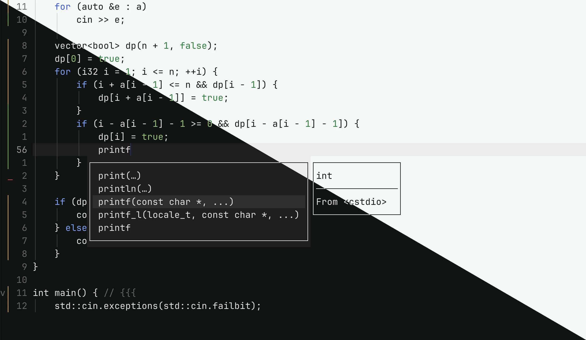

# midnight.nvim

Neovim theme for code, not colors.



## Installation

With `vim.pack` (Neovim 0.12+):

```lua
vim.pack.add({
  'https://forge.barrettruth.com/barrettruth/midnight.nvim',
})
```

Then set the colorscheme:

```lua
vim.cmd.colorscheme('midnight')
```

## Documentation

```vim
:help midnight
```

## Plugin Integrations

- [treesitter](https://github.com/nvim-treesitter/nvim-treesitter)
- [fzf-lua](https://github.com/ibhagwan/fzf-lua)
- [nvim-cmp](https://github.com/hrsh7th/nvim-cmp),
  [blink.cmp](https://github.com/saghen/blink.cmp)
- [gitsigns.nvim](https://github.com/lewis6991/gitsigns.nvim)
